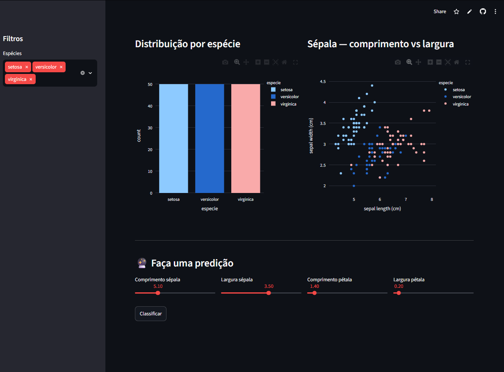

# 🌸 Dashboard ML — Classificador de Flores Iris

App interativo construído com Streamlit que combina exploração de dados, visualizações dinâmicas e predições em tempo real com Random Forest.

## 🔗 [Acesse o app ao vivo](https://app-app-ddme4qe2sttvkwrwvlc8zu.streamlit.app)

[](https://colab.research.google.com/github/luccasnn/app-streamlit/blob/main/app_streamlit.ipynb)

## Funcionalidades

- **Filtros dinâmicos** — seleciona espécies na sidebar e os gráficos atualizam em tempo real
- **Métricas** — total de flores, espécies selecionadas e accuracy do modelo
- **Gráfico de distribuição** — histograma interativo por espécie
- **Scatter plot** — relação entre comprimento e largura da sépala por espécie
- **Predição interativa** — ajusta os sliders com as medidas da flor e clica em Classificar
- **Probabilidades** — gráfico de barras com a confiança do modelo para cada espécie

## Como foi feito

O app usa `@st.cache_resource` para treinar o modelo uma única vez e reutilizar em todas as interações — sem isso o modelo seria retreinado a cada clique. Os gráficos são feitos com Plotly e renderizados diretamente no Streamlit.

## Tecnologias

- Python 3
- Streamlit — framework do app web
- Plotly — gráficos interativos
- scikit-learn — modelo Random Forest
- pandas e NumPy — manipulação dos dados

## Como rodar localmente

```bash
pip install -r requirements.txt
streamlit run app.py
```

## Resultado


